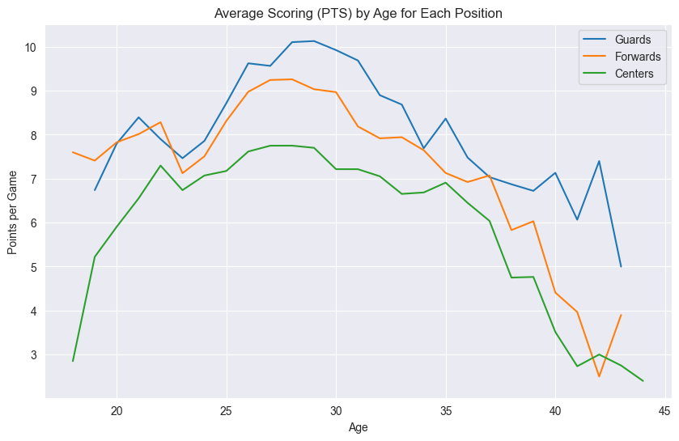
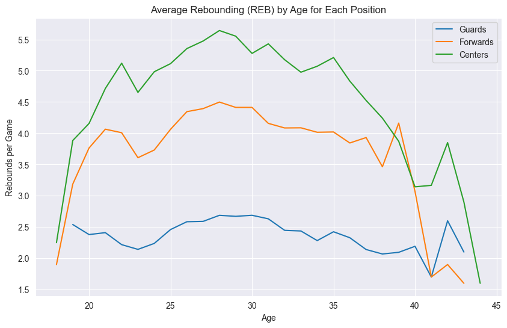
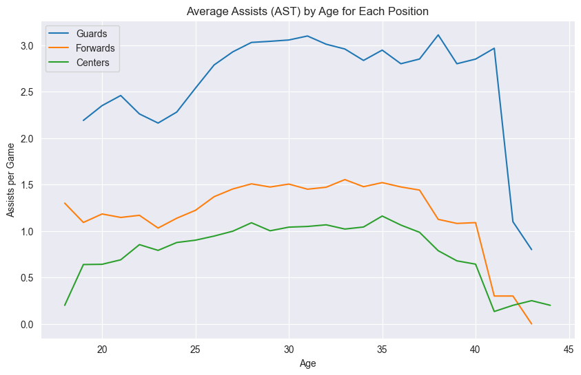
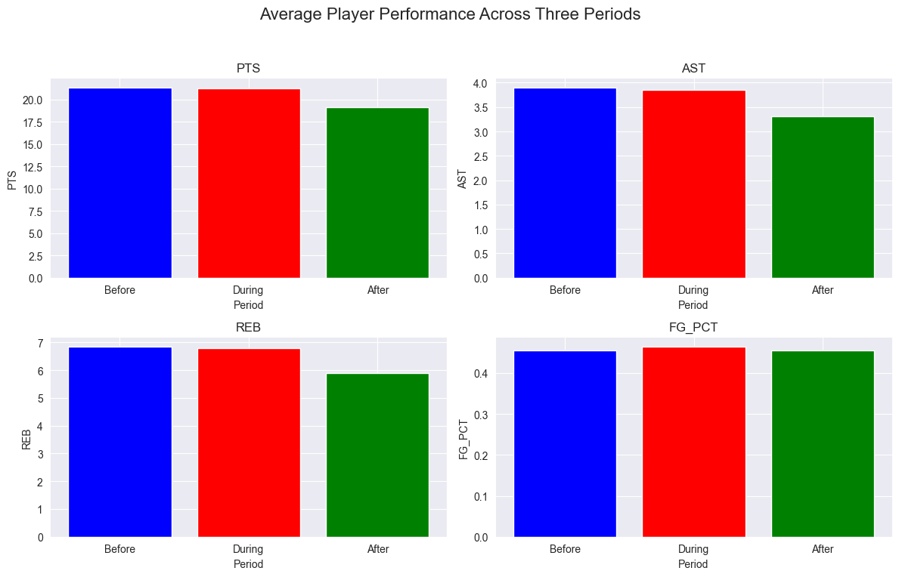
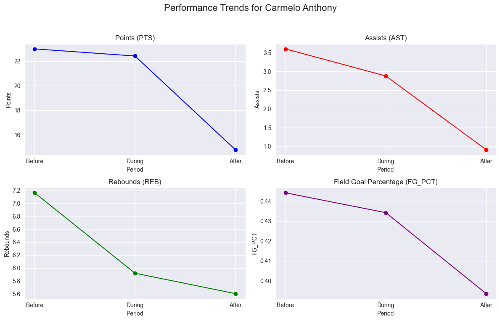

## NBA Players Data Analysis

### Introduction
This project was inspired by an analysis on Kaggle focusing on NBA height and weight data ([NBA Height and Weight Analysis](https://www.kaggle.com/code/justinas/nba-height-and-weight-analysis)). While the original analysis provided insightful observations in various areas, it lacked specific position data for NBA players. Recognizing the importance of player positions in understanding the relationship between player attributes (such as height and weight) and their performance in different roles, this project aims to fill that gap. By integrating position data into the existing dataset, we seek to offer a more nuanced analysis that considers the critical aspect of player positions and how they correlate with other success factors in the NBA.

---

### Data Source
The initial data were sourced from [Kaggle: NBA Players Data](https://www.kaggle.com/datasets/justinas/nba-players-data).  
The data for this analysis was obtained using the [`nba_api`](https://github.com/swar/nba_api), an API client for the NBA. This Python library provides access to live data, statistics, and other information from the NBA.

---

### Dataset Overview
This dataset contains detailed information on NBA players from various seasons. The key features include:

- **Player Name**: Names of the players.
- **Team Abbreviation**: Abbreviations of teams the players belonged to.
- **Age**: Age of the players.
- **Player Height**: Heights of the players (in cm).
- **Player Weight**: Weights of the players (in kg).
- **College**: Colleges attended by the players.
- **Country**: Countries the players are from.
- **Draft Year**, **Draft Round**, **Draft Number**: Draft details.
- **PTS**, **REB**, **AST**: Average points, rebounds, and assists per game.
- **Net Rating**, **OREB%**, **DREB%**, **USG%**, **TS%**, **AST%**: Advanced statistics.
- **Season**: NBA season.
- **Position**: Player positions (G - Guard, F - Forward, C - Center).

The initial data were sourced from [Kaggle: NBA Players Data](https://www.kaggle.com/datasets/justinas/nba-players-data). Further, the player positions were added using a Jupyter Notebook (`fetch_position.ipynb`), enhancing the dataset with additional categorization.

---

### Additional Datasets and Analysis Context

In addition to the main dataset, this analysis also utilizes three other key datasets which focus on the performance of specific NBA players during notable periods in their careers. These periods are often aligned with significant off-court events in their lives:

1. **Shaquille O’Neal** - Focusing on the 2007-2008 NBA season, aligning with his divorce filing.
2. **Kobe Bryant** - Analyzing the 2003-2004 NBA season, corresponding to his legal troubles.
3. **Derrick Rose** - Considering the 2016-2017 season, during which he faced a civil lawsuit.
4. **Dwight Howard** - Analyzing multiple seasons, such as the 2012-2013 season (his first with the Lakers) and others deemed significant, given the ongoing nature of his off-court issues.
5. **Carmelo Anthony** - Selecting seasons that align with his reported relationship issues, like the 2016-2017 season.
6. **Allen Iverson** - Focusing on the 2000-2001 season, where Iverson faced several personal challenges.
7. **Gilbert Arenas** - Analyzing the 2009-2010 season, corresponding to his suspension.
8. **Paul Pierce** - Considering the 2000-2001 season following his stabbing incident in 2000.
9. **Kevin Love** - Focusing on the 2018-2019 season, where Love was open about his struggles with mental health.
10. **DeMar DeRozan** - Analyzing the 2018-2019 season, following his trade to the Spurs and his openness about mental health.

These datasets (`before_averages.csv`, `after_averages.csv`, and `target_average_player_stats.csv`) are used to analyze the performance metrics of these players before and after the specific events, providing insights into how off-court issues might have impacted their on-court performance.

---

### Methodology

#### Data Acquisition and Processing
The project's data acquisition and processing are handled through these primary files:

1. **Position Data Integration (`fetch_position.ipynb`)**: This notebook augments the main dataset with player position data. This addition is vital for analyzing the relationship between player attributes, such as height and weight, and their performance in different positions.

2. **Off-Court Event Data Collection (`fetchData_OffCourt.ipynb`, `dataProcessing_OffCourt.py` and `fetchData_OffCourt.py`)**: These files focus on gathering data related to players' off-court events. This data is crucial for understanding how personal events outside the court may influence players' on-court performance metrics.

#### Analysis Approach
The analysis is divided into two main areas:

- **Position and Physical Attributes Analysis (`positionAnalysis.ipynb`)**: This part of the analysis aims to understand the correlation between players' physical attributes and their performance in various playing positions. It involves a detailed examination of the dataset, enriched with position data, to draw insights into how height, weight, and position interplay in determining a player's success.

- **Impact of Off-Court Events on Performance (`offCourtImpactAnalysis.ipynb`)**: The second focus is on exploring the impact of off-court events on players' on-court performance. This involves comparing performance metrics before and after specific personal events to uncover patterns and insights into how these events might affect players' professional basketball careers.

Through these methodologies, the project provides a comprehensive view of NBA players, merging physical, professional, and personal dimensions to offer a deeper understanding of the factors influencing their performance.

---

### Results and Visualizations

**Position and Physical Attributes Analysis: Impact of Age on Performance by Position**:
- **Scoring Abilities**: We observed that scoring abilities across all positions tend to peak in the mid to late 20s, followed by a gradual decline. This trend highlights how physical peak and experience contribute to scoring efficiency.
  
  

- **Rebounding Ability**: Interestingly, rebounding ability appears to be less affected by age, with stable averages throughout players' careers, regardless of position. This suggests that the skills required for effective rebounding might not diminish significantly with age.

  

- **Assist Trends**: Assists showed no significant decline with age. For guards, assists may even improve, indicating that experience and strategic understanding are crucial for playmaking.

  

**Discussion**:
These findings provide valuable insights into how age and experience interact with player performance. The patterns observed in scoring, rebounding, and assists offer a nuanced understanding of player development and longevity in professional basketball. Particularly, the improvement in assists with age for guards suggests that cognitive aspects of the game, such as decision-making and anticipation, may become more refined over time. This analysis sets a foundation for further research into the lifecycle of an NBA player's career and how teams can optimize strategies around player aging and performance evolution.

For a more comprehensive analysis, please refer to our [Position Analysis Notebook](https://github.com/ChuanCheLin/NBA-Height-and-Weight-Analysis/blob/main/positionAnalysis.ipynb).

**Impact of Off-Court Events on Performance**:
Our hypothesis that NBA players might experience a decline in on-court performance following significant off-court events was explored. We compared players' performance metrics before, during, and after the events.

- **Overall Performance Trends**: The bar chart below shows a generalized view of player performance across three key metrics: points (PTS), rebounds (REB), and field goal percentage (FG_PCT). There's an observable dip during the period of the off-court event, followed by a variable recovery in the aftermath.
  
  

- **Case Study - Carmelo Anthony**: This line graph offers a deeper dive into Carmelo Anthony's performance before, during, and after his off-court event. The trends indicate a marked decrease in points, assists, and field goal percentage, which may corroborate the hypothesis of off-court challenges impacting on-court performance.

  

**Discussion**:
The visualizations underscore a potential correlation between off-court events and a temporary decline in player performance metrics. While not all players follow this pattern, the data suggests that personal challenges can affect professional performance. However, the degree and duration of the impact appear to be individualized, with some players showing resilience and recovery over time. This discovery prompts further investigation into the support systems and coping mechanisms that can help athletes maintain or regain their professional form during and after personal upheavals.

For a more comprehensive analysis, please refer to our [Off-Court Impact Analysis Notebook](https://github.com/ChuanCheLin/NBA-Height-and-Weight-Analysis/blob/main/offCourtImpactAnalysis.ipynb).

---

### Setting Up the Environment

To replicate the analysis and run the notebooks locally, you can follow these steps to set up a virtual environment and install the required packages.

#### Prerequisites

- Python 3.7+
- `virtualenv` (if not installed, you can install it using `pip install virtualenv`)

#### Steps

- Clone this repository to your local machine.

```bash
git clone https://github.com/ChuanCheLin/NBA-Height-and-Weight-Analysis.git
cd NBA-Height-and-Weight-Analysis
```
- Create a virtual environment (venv) for this project. Replace <venv_name> with your preferred name for the virtual environment.
```bash
python -m venv <venv_name>
```
- Activate the virtual environment:
- On Windows:
```bash
<venv_name>\Scripts\activate
```
- On macOS and Linux:
```bash
source <venv_name>/bin/activate
```

- Install the required packages using pip and the provided requirements.txt file:
```bash
pip install -r requirements.txt
```